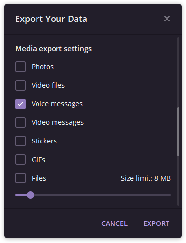
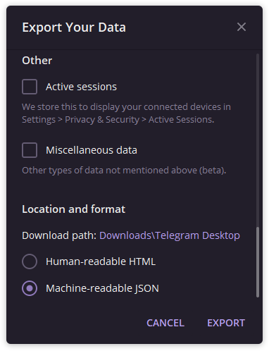

# Grab Telegram Voices

## Why?
Initially, Telegram exports files without any indication of the sender in the file name. 
With this script, you can definitely move voice messages to a folder that is convenient for you.
```
+---chats
|   +---chat_01
|   |   ---stickers
|   |   ---voice_messages
|   |      --- audio_2@02-11-2019_15-55-18.ogg
|   +---chat_03
|   |   ---stickers
|   +---chat_04
|   |   ---stickers
|   |   ---voice_messages
|   |      --- audio_2@02-11-2029_25-45-11.ogg
|   \---chat_05
|       ---voice_messages
----result.json
```
## Example of use
```
(venv) grabtelegramvoices> python .\main.py
# Telegram Voices Grabber

0 Mark
1 Alice
2 Bob
Choose contact to export:
> 1
Select the folder where you want to save the files:
> exported/Alice
```
Export voice messages from `Alice` to `./exported/Alice/` folder
```
+---exported
|   ---Alice
|      --- audio_2@02-11-2029_25-45-11.ogg
```
## How I can export voices from Telegram?
1. Go to Settings->Advanced->Export Telegram Data

2. Then select "voice messages" in Media export settings and check Machine-readable JSON in Location and format




3. Click the Export button

[If you have problems with this](https://telegram.org/blog/export-and-more)
4. Open folder and make sure that the file is result.json exists
5. Move the script to a folder and run it.
